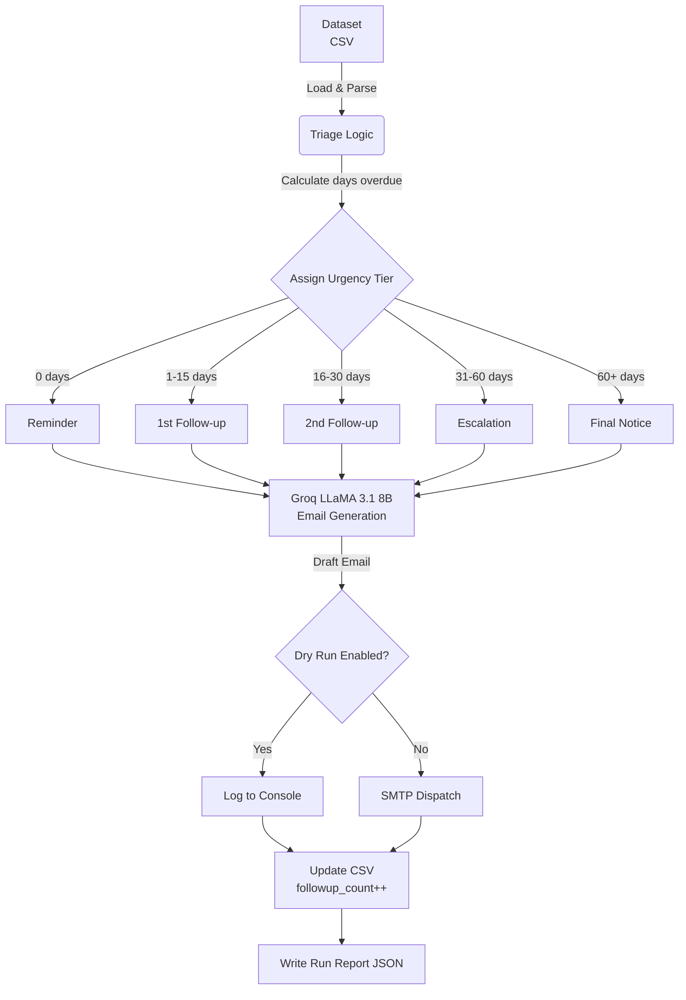

# Finance Credit Follow-Up Email Agent

An autonomous AI agent designed to streamline accounts receivable operations. This system ingests outstanding invoice data, determines the appropriate escalation tier based on payment delinquency, uses an LLM (Groq LLaMA 3.1) to draft highly personalized follow-up emails, dispatches them via SMTP, and automatically updates tracking records.

Built for finance teams, this agent replaces manual email chasing with a deterministic, fully automated workflow that preserves a professional tone while strictly adhering to financial escalation protocols.

## ⚙️ Architecture Workflow



## 🚀 Quickstart

**1. Clone the repository**
```bash
git clone https://github.com/suresh-jakhar/Finance-Credit-Follow-Up-Email-Agent.git
cd Finance-Credit-Follow-Up-Email-Agent
```

**2. Setup Virtual Environment & Install Dependencies**
```bash
python -m venv .venv
source .venv/bin/activate  # On Windows: .venv\Scripts\activate
pip install -r requirements.txt
```

**3. Configure Environment Variables**
Copy the sample config and add your keys:
```bash
cp .env.example .env
```
Ensure your `.env` contains your Groq API key:
```env
GROQ_API_KEY=gsk_your_key_here
LLM_MODEL=llama-3.1-8b-instant
DRY_RUN=True
```
*(Optional)* Add SMTP credentials to `.env` if you plan to use live email dispatch.

**4. Run the Agent**
```bash
# Safe mode (simulates email sending)
python main.py --dry-run

# Live mode (sends real emails via SMTP)
python main.py --send
```

## 📊 Dataset Schema

The agent expects a CSV file (`Dataset/Data_Ingestion.csv`) with the following structure:

| Column Name | Type | Description |
|---|---|---|
| `invoice_no` | String | Unique identifier (e.g., INV-1001) |
| `client_name` | String | Name of the client |
| `contact_email` | String | Recipient email address |
| `invoice_amount` | Float | Outstanding balance |
| `due_date` | Date (YYYY-MM-DD) | Original due date |
| `payment_status` | String | "Pending" or "Paid" (Agent ignores "Paid") |
| `days_overdue` | Integer | Dynamically recalculated at runtime |
| `followup_count` | Integer | Times client has been emailed |
| `last_followup_date` | Date (YYYY-MM-DD) | Date of last dispatched email |

## 📈 Escalation Logic

The agent assigns an urgency tier based on a combination of `days_overdue` and `followup_count`. This dictates the prompt context sent to the LLM.

| Tier | Condition | Tone / Action |
|---|---|---|
| **Reminder** | 0 days overdue | Polite, helpful reminder |
| **First Follow-up** | 1-15 days or 1st attempt | Direct, assuming oversight |
| **Second Follow-up** | 16-30 days or 2nd attempt | Firmer, requesting ETA |
| **Escalation** | 31-60 days or 3rd/4th attempt | Stern, warning of credit impact |
| **Final Notice** | 60+ days or 5th attempt | Ultimatum, threat of legal/collections |

## 📝 Sample Output

The agent produces a detailed JSON summary report in the `outputs/` directory after every run:

```json
{
  "total_processed": 85,
  "total_sent": 85,
  "total_skipped": 0,
  "total_errors": 0,
  "report_file": "outputs/run_report_20260509T081436Z.json",
  "log": [
    {
      "timestamp": "2026-05-09T08:06:50.123456",
      "invoice_no": "INV-1088",
      "action": "email_generated",
      "result": "ok",
      "reason": "Tier: final_notice. Subject: Final Notice: Overdue Invoice INV-1088"
    },
    {
      "timestamp": "2026-05-09T08:06:50.234567",
      "invoice_no": "INV-1088",
      "action": "email_sent",
      "result": "dry_run",
      "reason": "to=billing@starkindustries.com | status=dry_run"
    }
  ]
}
```

## 🛠️ Tech Stack

- **Language:** Python 3.12
- **Agent Orchestration:** LangChain / custom deterministic pipeline
- **LLM Engine:** Groq API (`llama-3.1-8b-instant`) via `langchain-groq`
- **Data Handling:** `pandas`
- **Email:** Native Python `smtplib` / `email.mime`