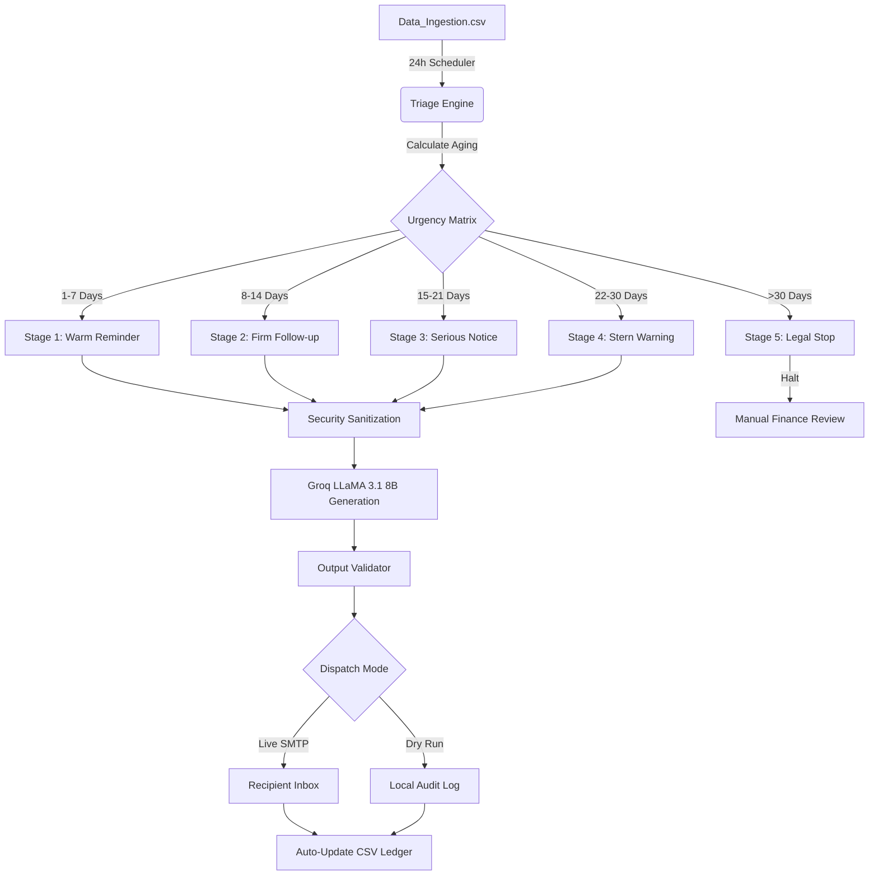

# Enterprise Credit Collections Agent

Chasing unpaid invoices is a repetitive manual task that consumes hours of finance teams’ time. I built this autonomous agent to manage the entire “accounts receivable” process, from triaging overdue payments, to writing personalized, context-aware emails, to updating the ledger.

## Workflow

It follows a 5-Stage Tone Escalation Matrix I created to balance professional courtesy and firm collection tactics.




## Tech Stack & Rationale

- **LLM: Groq (LLaMA 3.1 8B)**: picked Groq for its fast inference speeds and generous free-tier credits, allowing for rapid testing and iteration while still delivering solid reasoning quality for writing professional emails.
- **Orchestration: LangChain & LangGraph**:
    - **LangChain** provides the "Tools" (Emailing, CSV Loading) and Prompt Templates.
    - **LangGraph** allows the agent to be "Stateful"—it remembers which stage of the run it is in and can recover from errors without losing progress.
- **Automation: APScheduler**: Implemented as a background service with **Timezone Support (Asia/Kolkata)** and a live ticking countdown timer in the terminal.
- **Logging**:  JSON log file 
- **Monitoring: Streamlit**: View of the collection pipeline and aging reports.

## Security & Risk Mitigation


1.  **Prompt Injection Defense**: Every piece of CSV data is scrubbed through a **Sanitization Layer** before reaching the LLM to prevent "Ignore previous instructions" attacks.
2.  **PII Data Privacy**: Audit logs use a custom **Redaction Utility** to mask email addresses (e.g., `s***@gmail.com`), ensuring PII is never stored in plain text on disk.
3.  **Hallucination Guard**: A **Structure Validator** checks every LLM response. If the AI misses a subject line or messes up a payment link, the system halts the send and logs a validation error.
4.  **Strategic Stop-Limit**: The agent is hard-coded to **Halt at Stage 5**. It is forbidden from auto-escalating to legal action without a human "Manual Override."

## Future Scaling

- **FastAPI Integration**: I will wrap the agent in a REST API to allow ERP systems (SAP/QuickBooks) to trigger follow-ups via Webhooks.
- **Redis Rate Limiting**: I will implement token-bucket limiting to prevent API abuse and manage LLM cost-efficiency.
- **SQL Backend**: I will transition from CSV to a proper relational database (PostgreSQL) for handling thousands of concurrent invoices.

## Setup & Usage

**1. Configuration**
Define your credentials and automation settings in `.env`:
```ini
SCHEDULE_HOUR=09:00     # Daily trigger time
TIMEZONE=Asia/Kolkata   # Your local timezone
DRY_RUN=true            # Set to false for live SMTP
```

**2. Launching the Agent**
```bash
python main.py          # Starts the 24h background scheduler
python main.py --now    # Forces an immediate sweep
```

