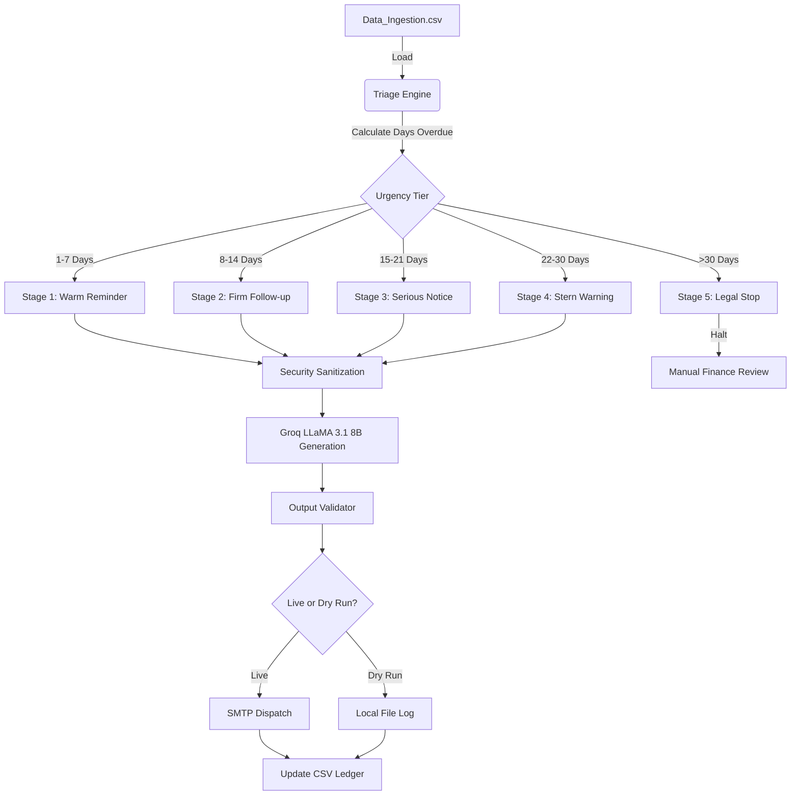

# Agent Email Followup Finance

Chasing unpaid invoices is a repetitive manual task that consumes hours of finance teams’ time. I built this autonomous agent to manage the entire “accounts receivable” process, from triaging overdue payments, to writing personalized, context-aware emails, to updating the ledger.


# The How It Works (The Logic)

It follows a **5-Stage Tone Escalation Matrix** I created to balance professional courtesy and firm collection tactics.



## 🛠️ Tech Stack & Rationale

- **LLM: Groq (LLaMA 3.1 8B)**:picked Groq for its fast inference speeds and generous free-tier credits, allowing for rapid testing and iteration while still delivering solid reasoning quality for writing professional emails.
- **Orchestration: LangChain & LangGraph**: I leveraged LangGraph to orchestrate stateful workflows and run tools agent-like. I built a lightweight custom Python control loop for the final production workflow, to better handle token usage under Groq’s free-tier limits, while preserving tool-calling and iterative agent behavior.
- **Frontend: Streamlit**: I built a simple monitoring dashboard, so finance managers can get a bird's eye view of the aging pipeline without having to directly interact with the underlying code.

## 🛡️ Security Risk Mitigation

Since this agent handles sensitive client data and dispatches real emails, I implemented several defensive layers:

| Risk | Mitigation Strategy |
| :--- | :--- |
| **Prompt Injection** | I built a **Sanitization Layer** that scrubs malicious patterns (like "Ignore previous instructions") from the CSV data before it ever reaches the prompt. |
| **Data Privacy (PII)** | The logging system uses a custom **PII Masking** utility. Email addresses are redacted (e.g., `s***@gmail.com`) in all audit logs to protect client privacy. |
| **Hallucination** | Every LLM-generated email passes through a **Structure Validator**. If the AI hallucinates a wrong amount or a broken link, the system halts the send and logs a security error. |
| **Human-in-the-Loop** | I implemented a **Hard Stop at Stage 5**. Once an invoice is >30 days overdue, the agent is forbidden from auto-sending; it requires a manual override by the Finance Team. |

## 🚀 Setup Instructions

**1. Environment Setup**
```bash
# Create and activate virtual environment
python -m venv .venv
source .venv/bin/activate  

# Install dependencies
pip install -r requirements.txt
```

**2. Configuration**
Create a `.env` file based on `.env.example`:
```DRY_RUN=true  # Set to false for live dispatch
```

**3. Run the System**
```bash
# Start the Agent
python main.py

# Launch the Monitoring Dashboard
streamlit run dashboard.py
```

---